# FyxLife – Fitness Tracking App 🏃‍♂️💙💜

<p align="center">
  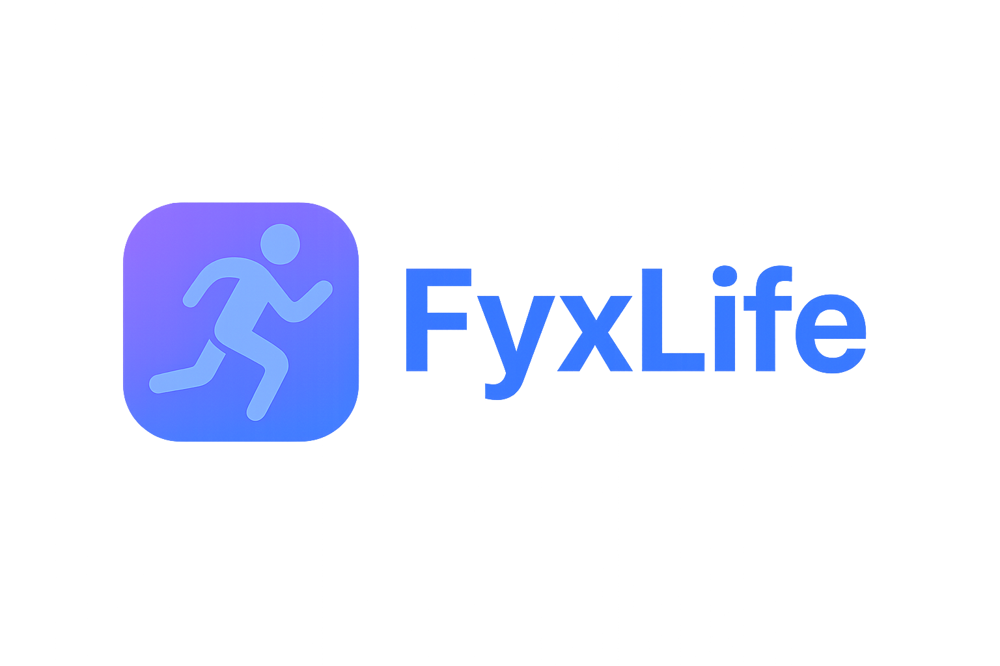
</p>

A modern **fitness tracking application** built with **React Native + Expo**.  
FyxLife helps users set fitness goals, track activities, explore health content, and stay motivated with daily challenges.  

---

## 🎥 Demo Video

Watch a screen recording of the working app here:  
[▶️ App Demo](./assets/screenShort/app-demo.mp4)

---

## 📸 Screenshots

Here are some previews of various pages of the app:

| Home | Profile | Goals |
|------|---------|-------|
| 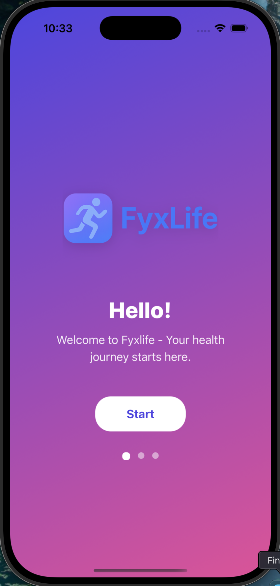 | 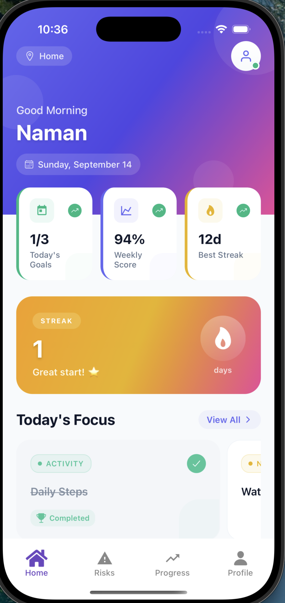 | 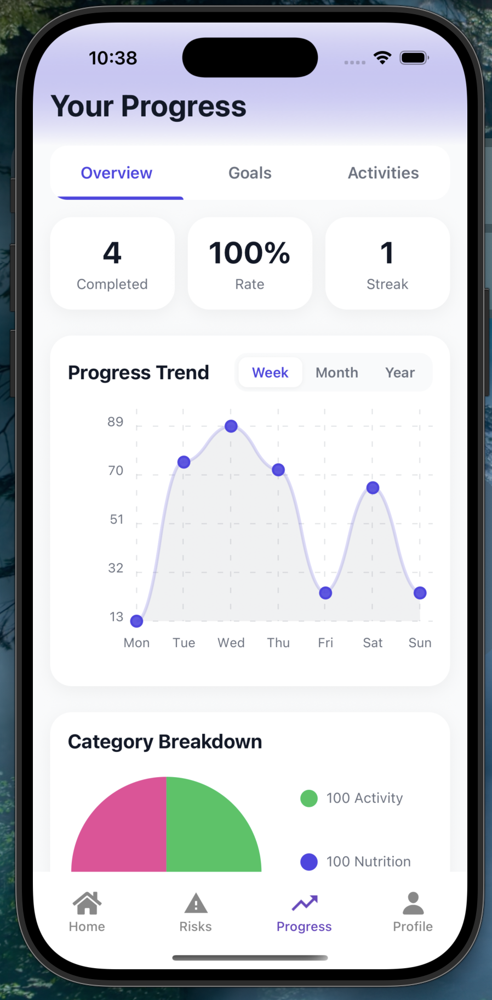 |

---

## ⚡️ Getting Started

Follow these steps to set up and run the project locally:

### 1. Clone the Repository
```bash
git clone https://github.com/Naman503/FitnessTrackingApp.git
cd fyxlife-app
```

### 2. Install Dependencies
Make sure you have Node.js and Expo CLI installed.

Then install project dependencies:

```bash
yarn install
or

npm install
```

### 3. Start the Expo App
```bash
npx expo start
```
This will launch the Expo Developer Tools in your browser.
You can then run the app on:

iOS Simulator (Mac only)

Android Emulator

Physical Device (via Expo Go app)

📸 **Screenshots**

---

### Dashboard  
<p align="center">
  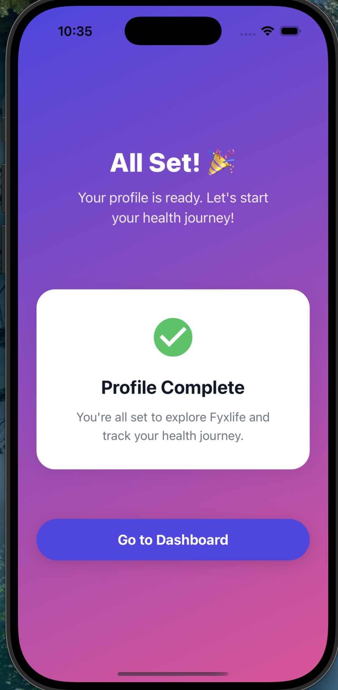 
   
  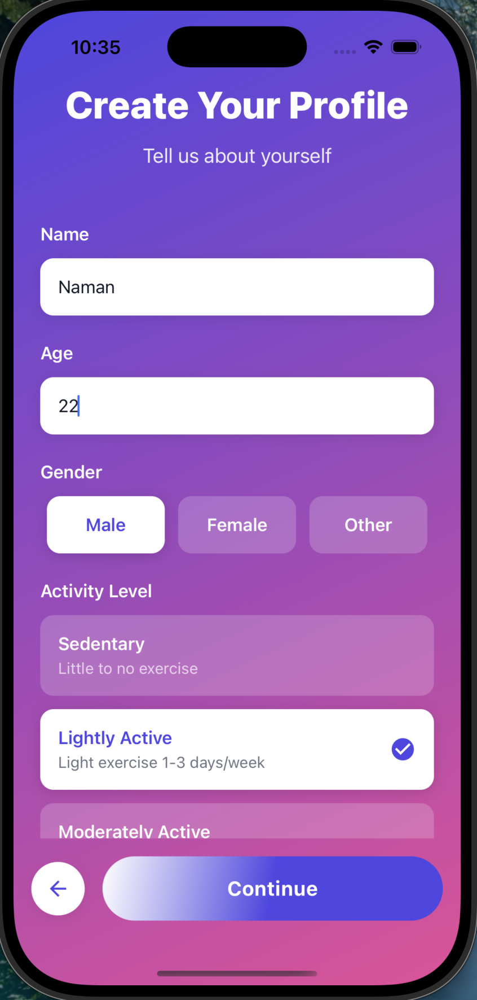 
  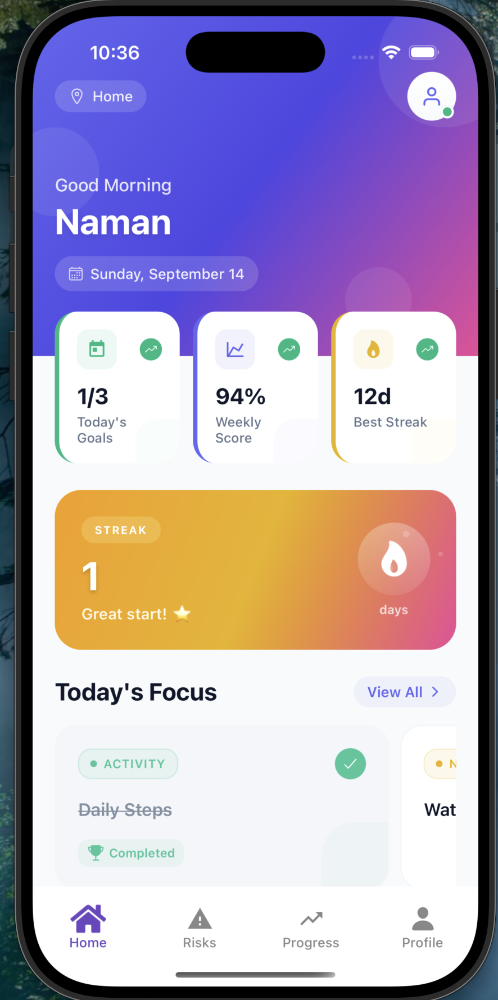 
</p>

---

### Profile  
<p align="center">
   
  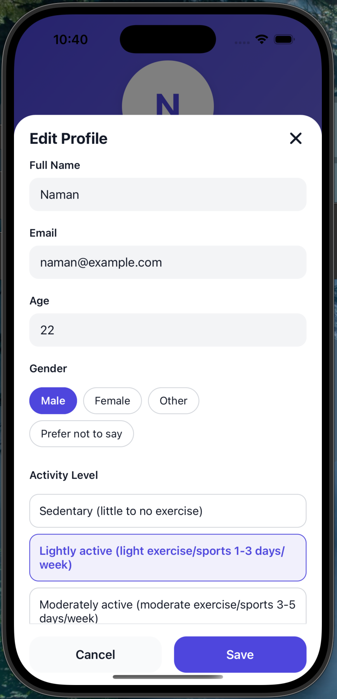 
</p>

---

### Progress Tracking  
<p align="center">
  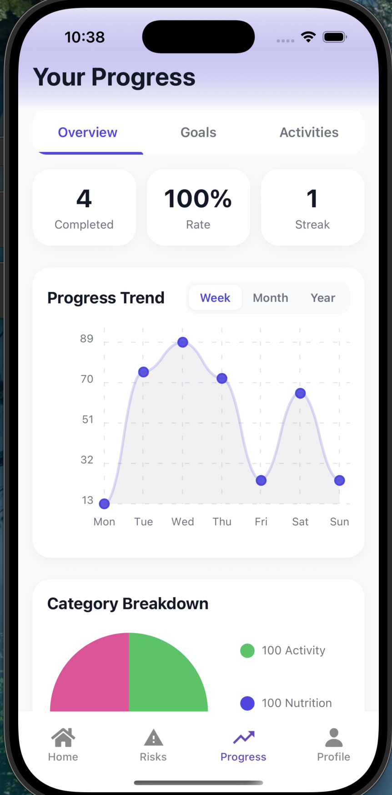 
  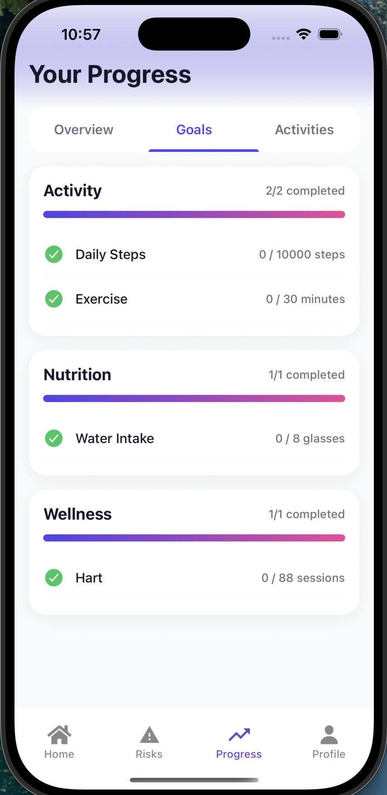 
  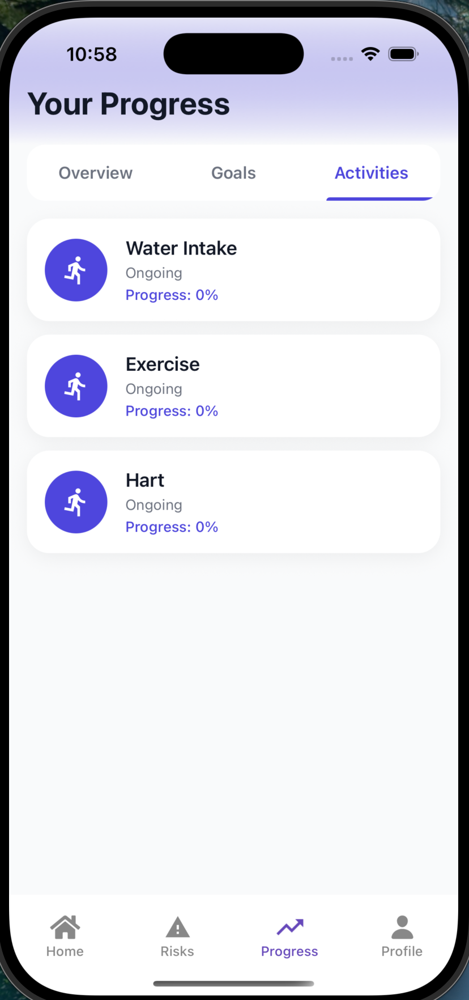 
</p>

---

### Risk Analysis  
<p align="center">
  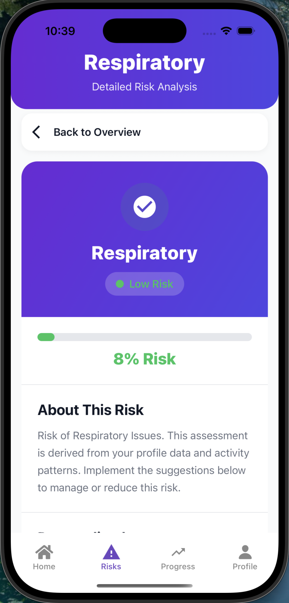 
  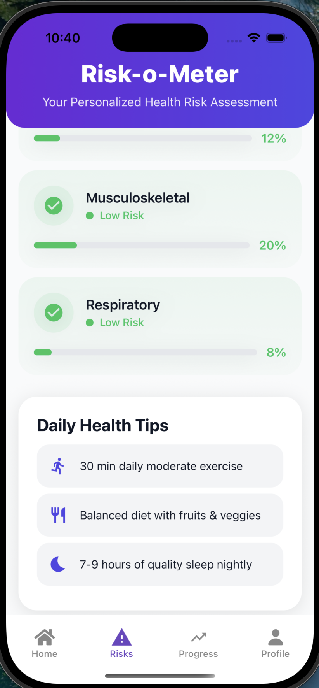 
</p>

---

### Sleep Tracking  
<p align="center">
  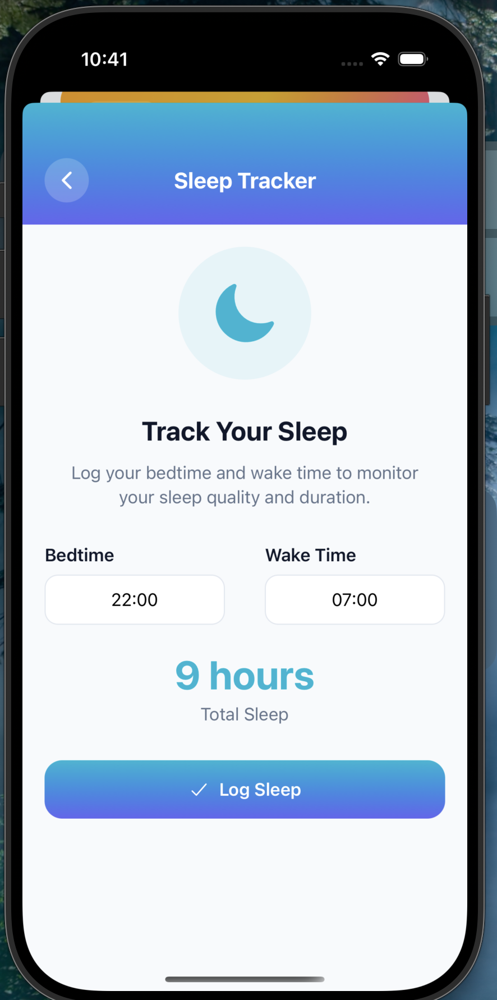 
</p>

---

### Nutrition  
<p align="center">
  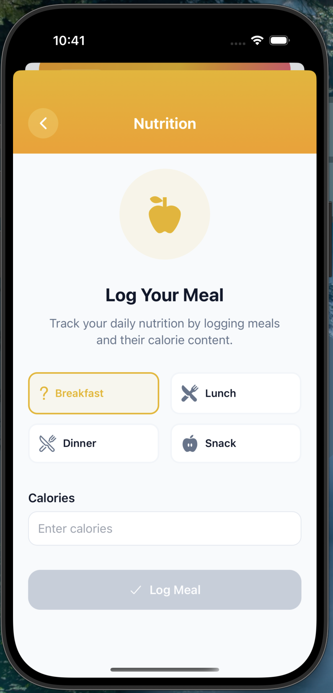 
</p>

---

### Workout  
<p align="center">
   
</p>
### 🛠 Frameworks & Tools
React Native (Expo) – Cross-platform framework

Expo Router – Navigation

Expo Linear Gradient – Modern UI effects

React Native Reanimated & Gesture Handler – Smooth animations

Ionicons – Icons

AI Assistance – For design, documentation, and prototyping

### 📝 Assumptions & Shortcuts
Local state management used (no backend yet)

Mock data for demo goals and activities

UI simplified for rapid prototyping

### 🔮 Scaling: v0 → v1
Planned upgrades:

Cloud sync for cross-device persistence

Richer analytics & AI-based personalization

Integration with wearables / health APIs

Daily challenges & reward system

Blogs and health-related content from external sources

Map integration for runners & hikers

---